<h2>TensorFlow-FlexUNet-Image-Segmentation-Brain-Tumor-Classification-MRI (2026/07/02)</h2>
Sarah T.  Arai 
Software Laboratory antillia.com  
This is the first experiment of Image Segmentation for
<a href="https://www.kaggle.com/datasets/mohamedaymanhassan/brain-tumor-images-classification-by-cnn">
 <b>Brain Tumor images Classification by CNN</b> 
</a> based on our <a href="https://github.com/sarah-antillia/TensorFlow-FlexUNet-Image-Segmentation-Model">
TensorFlow-FlexUNet-Image-Segmentation-Model</a> 
(TensorFlow Flexible UNet Image Segmentation Model for Multiclass) , 
and a 512x512 pixels PNG
<a href="https://drive.google.com/file/d/1gVZ5MkoDsVdCa_PLUmVAmp4VFfLBiRSs/view?usp=sharing">
<b>Brain-Tumor-Classification-MRI-ImageMask-Dataset.zip</b></a> with colorized masks 
(<a href="https://creativecommons.org/licenses/by-nc-sa/4.0/">CC BY-NC-SA 4.0</a>), which was derived by us from   
<a href="https://www.kaggle.com/datasets/mohamedaymanhassan/brain-tumor-images-classification-by-cnn">
<b>Brain Tumor images Classification by CNN</b> </a> by MohamedAyman.
  

<b>Actual Image Segmentation for Brain-Tumor-Classification-MRI of 512x512 pixels </b> 
As shown below, the inferred masks predicted by our segmentation model trained by the dataset appear similar to the 
ground truth masks.
  
<b>class_color_map = {Meningioma:blue, Glioma:green, Pituitary tumor:red}
</b>
  
<table>
<tr>
<th>Input: image</th>
<th>Mask (ground_truth)</th>
<th>Prediction: inferred_mask</th>
</tr>
<tr>
<td></td>
<td></td>
<td></td>
</tr>

<tr>
<td></td>
<td></td>
<td></td>
</tr>

<tr>
<td></td>
<td></td>
<td></td>
</tr>
</table>

 
<h3>1  Dataset Citation</h3>
The dataset used here was derived from   
<a href="https://www.kaggle.com/datasets/mohamedaymanhassan/brain-tumor-images-classification-by-cnn">
<b>Brain Tumor images Classification by CNN</b> </a> by MohamedAyman.  
The following explanation was taken from above web site.
  
<b>About Dataset</b> 
This dataset contains a collection of multimodal medical images, specifically CT (Computed Tomography) 
and MRI (Magnetic Resonance Imaging) scans, for brain tumor detection and analysis. 
It is designed to assist researchers and healthcare professionals in developing AI models for the 
automatic detection, classification, and segmentation of brain tumors. The dataset features images 
from both modalities, providing comprehensive insight into the structural and functional variations 
in the brain associated with various types of tumors.
  
The dataset includes high-resolution CT and MRI images captured from multiple patients, 
with each image labeled with the corresponding tumor type (e.g., glioma, meningioma, etc.) 
and its location within the brain. This combination of CT and MRI images aims to leverage 
the strengths of both imaging techniques: CT scans for clear bone structure visualization 
and MRI for soft tissue details, enabling a more accurate analysis of brain tumors.
  
I collected these data from different sources and modified data for maximum accuracy.  

<b>Brain Tumor CT scan Images source</b> 
CT Brain Segmentation Computer Vision Project -- 
<a href="https://universe.roboflow.com/joshua-zgc7b/ct-brain-segmentation">
https://universe.roboflow.com/joshua-zgc7b/ct-brain-segmentation
</a>
 
CT and MRI brain scans -- 
<a href="https://www.kaggle.com/datasets/darren2020/ct-to-mri-cgan">
https://www.kaggle.com/datasets/darren2020/ct-to-mri-cgan
</a> 
CT Head Scans(jpg files) -- 
<a href="https://www.kaggle.com/datasets/clarksaben/ct-head-scans">
https://www.kaggle.com/datasets/clarksaben/ct-head-scans
</a> 
Head CT Images for Classification -- 
<a href="https://www.kaggle.com/datasets/nipaanjum/head-ct-images-for-classification">
https://www.kaggle.com/datasets/nipaanjum/head-ct-images-for-classification
</a> 
Anonymous brain -- from private data 
Unpaired MR-CT Brain Dataset for Unsupervised Image Translation -- 
<a href="https://data.mendeley.com/datasets/z4wc364g79/1">
https://data.mendeley.com/datasets/z4wc364g79/1
</a> 
 
<b>Brain Tumor MRI images source</b> 
Brain Tumor (MRI Scans) -- 
<a href="https://www.kaggle.com/datasets/rm1000/brain-tumor-mri-scans">
https://www.kaggle.com/datasets/rm1000/brain-tumor-mri-scans</a> 
Brain Tumor MRIs -- 
<a href="https://www.kaggle.com/datasets/vinayjayanti/brain-tumor-mris">
https://www.kaggle.com/datasets/vinayjayanti/brain-tumor-mris
</a> 
Siardataset -- <a href="https://www.kaggle.com/datasets/masoumehsiar/siardataset">
https://www.kaggle.com/datasets/masoumehsiar/siardataset
</a> 
Brain tumors 256x256 -- 
<a href="https://www.kaggle.com/datasets/thomasdubail/brain-tumors-256x256">
https://www.kaggle.com/datasets/thomasdubail/brain-tumors-256x256
</a> 
Brain Tumor MRI Image Classification Dataset -- 
<a href="https://www.kaggle.com/datasets/iashiqul/brain-tumor-mri-image-classification-dataset">
https://www.kaggle.com/datasets/iashiqul/brain-tumor-mri-image-classification-dataset
</a> 
Brain Tumor MRI (yes or no) -- 
<a href="https://www.kaggle.com/datasets/mohamada2274/brain-tumor-mri-yes-or-no">
https://www.kaggle.com/datasets/mohamada2274/brain-tumor-mri-yes-or-no
</a> 
BRAIN TUMOR CLASS CLASS Computer Vision Project -- 
<a href="https://universe.roboflow.com/college-sf5ih/brain-tumor-class-class">
https://universe.roboflow.com/college-sf5ih/brain-tumor-class-class
</a> 
Brain Tumor Detection Computer Vision Project -- 
<a href="https://universe.roboflow.com/tuan-nur-afrina-zahira/brain-tumor-detection-bmmqz">
https://universe.roboflow.com/tuan-nur-afrina-zahira/brain-tumor-detection-bmmqz
</a> 
Tumor Detection Computer Vision Project -- 
<a href="https://universe.roboflow.com/brain-tumor-detection-wsera/tumor-detection-ko5jp">
https://universe.roboflow.com/brain-tumor-detection-wsera/tumor-detection-ko5jp
</a> 
 
<b>License</b> 
<a href="https://creativecommons.org/licenses/by-nc-sa/4.0/">CC BY-NC-SA 4.0</a>  
<h3>
2 Brain-Tumor-Classification-MRI ImageMask Dataset
</h3>
<h3>
2.1 Download ImageMask Dataset
</h3>
 If you would like to train this Brain-Tumor-Classification-MRI Segmentation model by yourself,
please down load our dataset <a href="https://drive.google.com/file/d/1gVZ5MkoDsVdCa_PLUmVAmp4VFfLBiRSs/view?usp=sharing">
<b>Brain-Tumor-Classification-MRI-ImageMask-Dataset.zip</b>
(<a href="https://creativecommons.org/licenses/by-nc-sa/4.0/">CC BY-NC-SA 4.0</a>)
</a> on the google drive,
expand the downloaded, and put it under <b>./dataset/</b> to be.
<pre>
./dataset
└─Brain-Tumor-Classification-MRI
    ├─test
    │   ├─images
    │   └─masks
    ├─train
    │   ├─images
    │   └─masks
    └─valid
        ├─images
        └─masks
</pre>
 
<b>Brain-Tumor-Classification-MRI Statistics</b> 
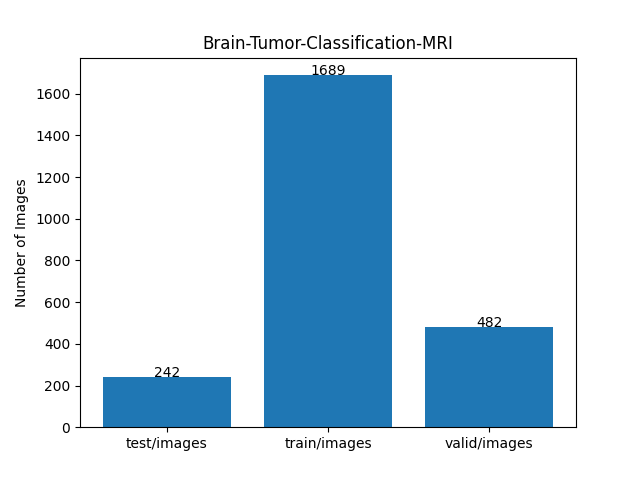 
 
As shown above, the number of images of train and valid datasets is large enough to use for a training set of our segmentation model.
  
<h3>
2.2 Derivation of Brain-Tumor-Classification-MRI Dataset
</h3>
The folder structure of the original <b>Dataet1</b> is the following,
but it contains no annotation(mask) files, because it is an image classification dataset. 
<pre>
./Dataet1
 ├─Brain Tumor CT scan Images
 │  ├─Healthy
 │  └─Tumor
 └─Brain Tumor MRI images
     ├─Healthy
...
     └─Tumor
         ├─glioma (1).jpg
...
         ├─glioma (672).jpg
         │
         ├─meningioma (1).jpg
...
         ├─meningioma (1112).jpg
         │
         ├─pituitary (1).jpg
...
         ├─pituitary (629).jpg
         │
         ├─tumor (1).jpg
...
         └─tumor (571).jpg
</pre>
<b>Step 1</b> 
We generated a 512x512 pixsels master PNG image files from the JPG files,
<b>glioma*.jpg</b>, <b>meningioma*.jpg</b> and <b>pituitary*.jpg</b> in <b>Brain Tumor MRI images/Tumor</b> folder.
not including <b>tumor*.jpg</b>.
  
<b>Step 2</b> 
We generated our own annotation (mask) files corresponding to the master images 
by applying an inference (segmentation) method of
a pretrained FlexUNet model <a href="https://github.com/sarah-antillia/TensorFlow-FlexUNet-Image-Segmentation-BRISC2025-BrainTumor">
TensorFlow-FlexUNet-Image-Segmentation-BRISC2025-BrainTumor
</a> to all master images, without human annotation experts.
  
<b>Step 3</b> 
We finally generated our ImageMask Dataset from all pairs of master images and their correspoinding mask files 
generated above step.
  
<h3>
2.3 Train Sample Images and Masks
</h3>
<b>Train_sample images</b> 

 
<b>Train_sample_masks</b> 

 
<h3>
3 Train TensorflowFlexUNet Model
</h3>
 We trained Brain-Tumor-Classification-MRI TensorflowFlexUNet Model by using the following
<a href="./projects/TensorFlowFlexUNet/Brain-Tumor-Classification-MRI/train_eval_infer.config"> <b>train_eval_infer.config</b></a> file.  
Please move to ./projects/TensorFlowFlexUNet/Brain-Tumor-Classification-MRI and run the following bat file. 
<pre>
>1.train.bat
</pre>
, which simply runs the following command. 
<pre>
>python ../../../src/TensorFlowFlexUNetTrainer.py ./train_eval_infer.config
</pre>

<b>Model parameters</b> 
Defined a small <b>base_filters=16</b> and a large <b>base_kernels=(11,11)</b> for the first Conv Layer of Encoder Block of 
<a href="./src/TensorFlowFlexUNet.py">TensorFlowFlexUNet.py</a> 
and a <b>large num_layers=8</b> (including a bridge between Encoder and Decoder Blocks).
<pre>
[model]
image_width    = 512
image_height   = 512
image_channels = 3
input_normalize = True
normalization  = False
num_classes    = 4
base_filters   = 16
base_kernels  = (11,11)
num_layers    = 8
dropout_rate   = 0.05
dilation       = (1,1)
</pre>

<b>Learning rate</b> 
Defined a small learning rate.  
<pre>
[model]
learning_rate  = 0.00007
</pre>

<b>Loss and metrics functions</b> 
Specified "categorical_crossentropy" and "dice_coef_multiclass". 
<pre>
[model]
loss           = "categorical_crossentropy"
metrics        = ["dice_coef_multiclass"]
</pre>
<b >Learning rate reducer callback</b> 
Enabled learing_rate_reducer callback, and a small reducer_patience.
<pre> 
[train]
learning_rate_reducer = True
reducer_factor     = 0.4
reducer_patience   = 4
</pre>
<b>Early stopping callback</b> 
Enabled early stopping callback with patience parameter.
<pre>
[train]
patience      = 10
</pre>
<b></b> 
<b>RGB color map</b> 
rgb color map dict for Brain-Tumor-Classification-MRI 1+3 classes. 
<pre>
[mask]
mask_file_format = ".png"
;Brain-Tumor-Classification-MRI 1+3
;                  Meningioma:blue, Glioma:green, Pituitary tumor:red      
rgb_map = {(0,0,0):0, (0,0,255):1, (0,255,0):2, (255,0,0):3,}       
</pre>
<b>Epoch change inference callbacks</b> 
Enabled epoch_change_infer callback. 
<pre>
[train]
epoch_change_infer       = True
epoch_change_infer_dir   =  "./epoch_change_infer"
epoch_changeinfer        = False
epoch_changeinfer_dir    = "./epoch_changeinfer"
num_infer_images         = 6
</pre>
By using this epoch_change_infer callback, on every epoch_change, the inference procedure can be called
 for 6 images in <b>mini_test</b> folder. This will help you confirm how the predicted mask changes 
 at each epoch during your training process.    
<b>Epoch_change_inference output at starting (1,2,3)</b> 
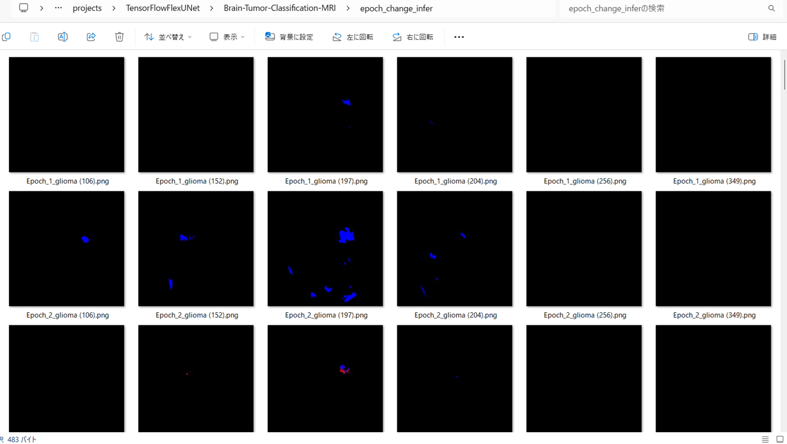 
 
<b>Epoch_change_inference output at middle-point (16,17,18)</b> 
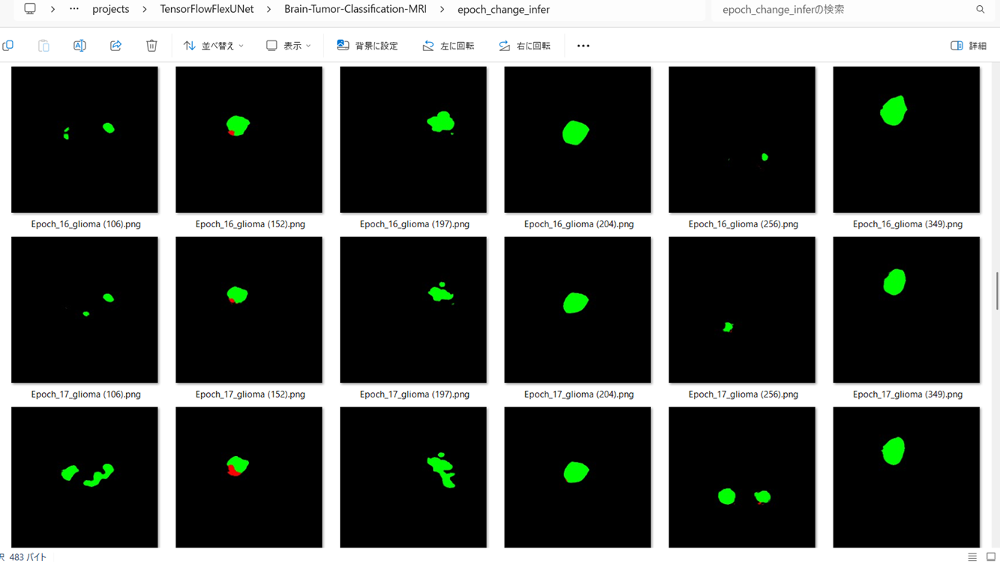 
 
<b>Epoch_change_inference output at ending (33,34,35)</b> 
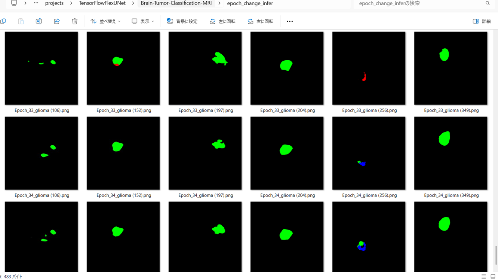 

 
In this experiment, the training process was stopped at epoch 35 by EarlyStoppingCallback.  
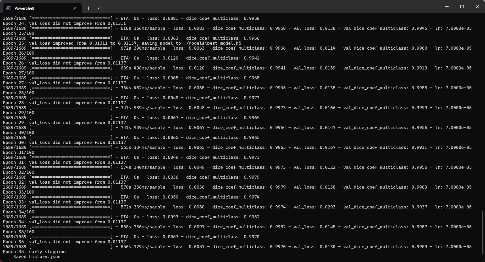 
 
<a href="./projects/TensorFlowFlexUNet/Brain-Tumor-Classification-MRI/eval/train_metrics.csv">train_metrics.csv</a> 
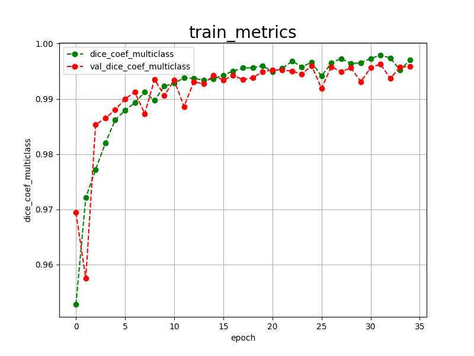 

 
<a href="./projects/TensorFlowFlexUNet/Brain-Tumor-Classification-MRI/eval/train_losses.csv">train_losses.csv</a> 
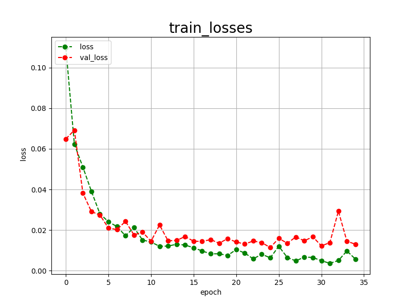 
 
<h3>
4 Evaluation
</h3>
Please move to <b>./projects/TensorFlowFlexUNet/Brain-Tumor-Classification-MRI</b> folder, 
and run the following bat file to evaluate TensorflowFlexUNet model for Brain-Tumor-Classification-MRI. 
<pre>
>./2.evaluate.bat
</pre>
This bat file simply runs the following command.
<pre>
>python ../../../src/TensorFlowFlexUNetEvaluator.py  ./train_eval_infer.config
</pre>
Evaluation console output: 
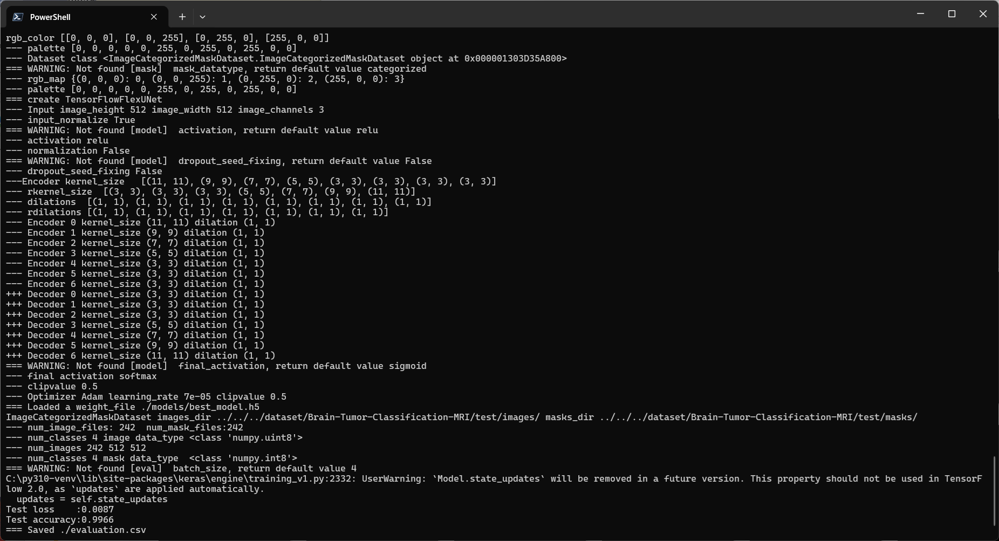
  Image-Segmentation-Brain-Tumor-Classification-MRI

<a href="./projects/TensorFlowFlexUNet/Brain-Tumor-Classification-MRI/evaluation.csv">evaluation.csv</a> 
The loss (categorical_crossentropy) to this Brain-Tumor-Classification-MRI/test was low, and dice_coef_multiclass high as shown below.
 
<pre>
categorical_crossentropy,0.0125
dice_coef_multiclass,0.9937
</pre>
 
<h3>5 Inference</h3>
Please move to <b>./projects/TensorFlowFlexUNet/Brain-Tumor-Classification-MRI</b> folder 
,and run the following bat file to infer segmentation regions for images by the Trained-TensorflowFlexUNet model for Brain-Tumor-Classification-MRI. 
<pre>
>./3.infer.bat
</pre>
This simply runs the following command.
<pre>
>python ../../../src/TensorFlowFlexUNetInferencer.py ./train_eval_infer.config
</pre>

<b>mini_test_images</b> 
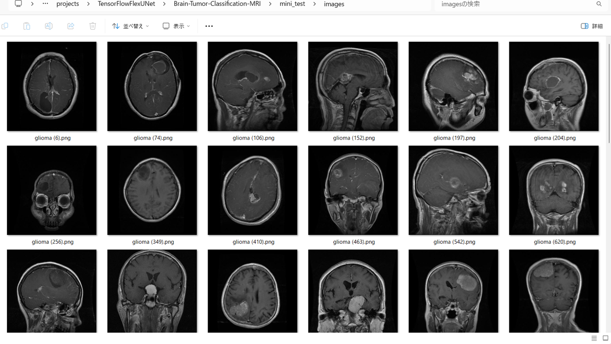 
<b>mini_test_mask(ground_truth)</b> 
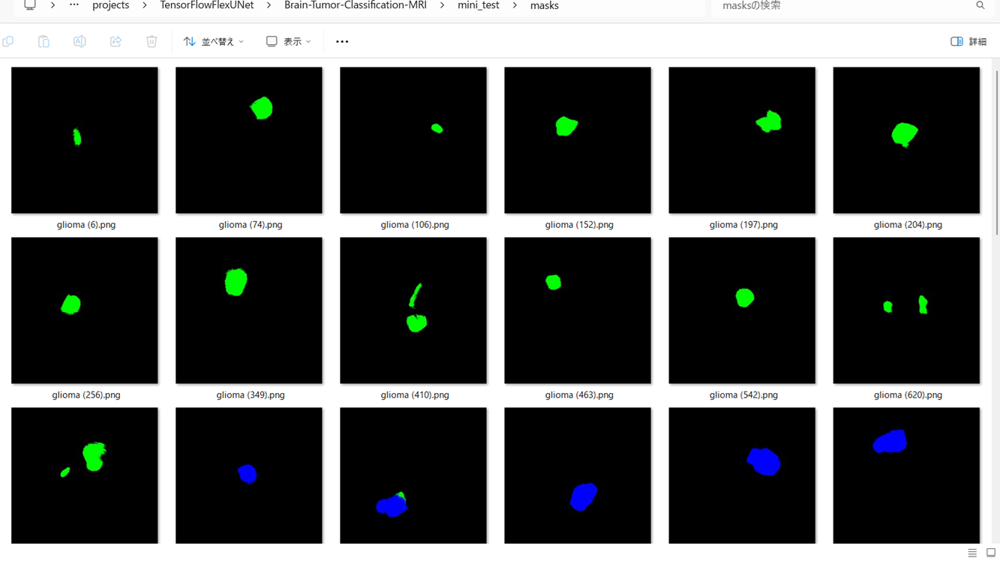 

<b>Inferred test masks</b> 
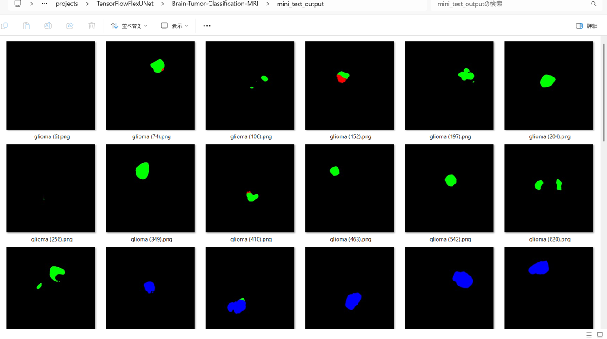 
 

<b>Enlarged images and masks for  Brain-Tumor-Classification-MRI of 512x512 pixels</b> 
As shown below, the inferred masks predicted by our segmentation model trained by the dataset appear similar to the 
ground truth masks, except the third and fifth cases.
  
<b>class_color_map = {Meningioma:blue, Glioma:green, Pituitary tumor:red}</b>
 
 
<table>
<tr>
<th>Input: image</th>
<th>Mask (ground_truth)</th>
<th>Prediction: inferred_mask</th>
</tr>
<tr>
<td></td>
<td></td>
<td></td>
</tr>

<tr>
<td></td>
<td></td>
<td></td>
</tr>

<tr>
<td></td>
<td></td>
<td></td>
</tr>
<tr>
<td></td>
<td></td>
<td></td>
</tr>
<tr>
<td></td>
<td></td>
<td></td>
</tr>
<tr>
<td></td>
<td></td>
<td></td>
</tr>
</table>

 
<h3>
References
</h3>
<b>1. TensorFlow-FlexUNet-Image-Segmentation-Brain-Tumor-Balanced-MRI</b> 
Toshiyuki Arai  
<a href="https://github.com/sarah-antillia/TensorFlow-FlexUNet-Image-Segmentation-Brain-Tumor-Balanced-MRI">
https://github.com/sarah-antillia/TensorFlow-FlexUNet-Image-Segmentation-Brain-Tumor-Balanced-MRI
</a>
 
 
<b>2. TensorFlow-FlexUNet-Image-Segmentation-Brain-Tumor-Unified-MRI</b> 
Toshiyuki Arai  
<a href="https://github.com/sarah-antillia/TensorFlow-FlexUNet-Image-Segmentation-Brain-Tumor-Unified-MRI">
https://github.com/sarah-antillia/TensorFlow-FlexUNet-Image-Segmentation-Brain-Tumor-Unified-MRI
</a>
 
 
<b>3. TensorFlow-FlexUNet-Image-Segmentation-Brain-Tumor-Consolidated-MRI</b> 
Toshiyuki Arai  
<a href="https://github.com/sarah-antillia/TensorFlow-FlexUNet-Image-Segmentation-Brain-Tumor-Consolidated-MRI">
https://github.com/sarah-antillia/TensorFlow-FlexUNet-Image-Segmentation-Brain-Tumor-Consolidated-MRI
</a>
 
 
<b>4. TensorFlow-FlexUNet-Image-Segmentation-Crystal-Clean-Brain-Tumor</b> 
Toshiyuki Arai  
<a href="https://github.com/sarah-antillia/TensorFlow-FlexUNet-Image-Segmentation-Crystal-Clean-Brain-Tumor">
https://github.com/sarah-antillia/TensorFlow-FlexUNet-Image-Segmentation-Crystal-Clean-Brain-Tumor
</a>
 
 
<b>5. TensorFlow-FlexUNet-Image-Segmentation-Figshare-BrainTumor</b> 
Toshiyuki Arai  
<a href="https://github.com/sarah-antillia/TensorFlow-FlexUNet-Image-Segmentation-Figshare-BrainTumor">
https://github.com/sarah-antillia/TensorFlow-FlexUNet-Image-Segmentation-Figshare-BrainTumor
</a>
 
 
<b>6. TensorFlow-FlexUNet-Image-Segmentation-BRISC2026-Brain-Tumor</b> 
Toshiyuki Arai  
<a href="https://github.com/sarah-antillia/TensorFlow-FlexUNet-Image-Segmentation-BRISC2026-Brain-Tumor">
https://github.com/sarah-antillia/TensorFlow-FlexUNet-Image-Segmentation-BRISC2026-Brain-Tumor
</a>
 
 
<b>7. TensorFlow-FlexUNet-Image-Segmentation-BRISC2025-BrainTumor</b> 
Toshiyuki Arai  
<a href="https://github.com/sarah-antillia/TensorFlow-FlexUNet-Image-Segmentation-BRISC2025-BrainTumor">
https://github.com/sarah-antillia/TensorFlow-FlexUNet-Image-Segmentation-BRISC2025-BrainTumor
</a>
 
 
<b>8. TensorFlow-FlexUNet-Image-Segmentation-Brain-Tumor-MRI </b> 
Toshiyuki Arai  
<a href="https://github.com/sarah-antillia/TensorFlow-FlexUNet-Image-Segmentation-Brain-Tumor-MRI">
https://github.com/sarah-antillia/TensorFlow-FlexUNet-Image-Segmentation-Brain-Tumor-MRI
</a>
 
 
<b>9. TensorFlow-FlexUNet-Image-Segmentation-Model</b> 
Toshiyuki Arai  
<a href="https://github.com/sarah-antillia/TensorFlow-FlexUNet-Image-Segmentation-Model">
TensorFlow-FlexUNet-Image-Segmentation-Model
</a>
 
 
